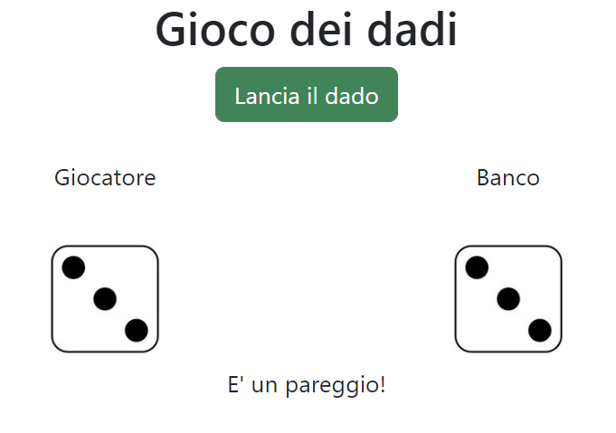

# Esercizio

---

## Gioco dei dadi

---

### Testo dell' esercizio

Generare un numero random da 1 a 6, sia per il giocatore sia per il computer.
Stabilire il vincitore, in base a chi fa il punteggio più alto.

---

### Algoritmo di svolgimento

**1.Logica del programma**

- Creiamo un bottone, al quale dopo il click:
1. Generiamo un numero random da parte dell ' utente
2. Generiamo un numero random da parte del computer
3. Confrontiamo i valori
4. Prepariamo il messaggio di output

**2. Output**

- Stampiamo un messaggio nel documento contenente l' esito del gioco.

---

## Anteprima

---

